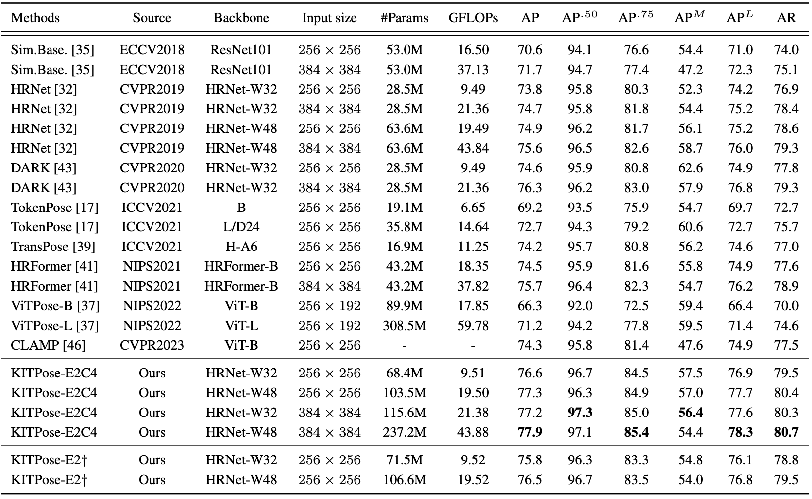
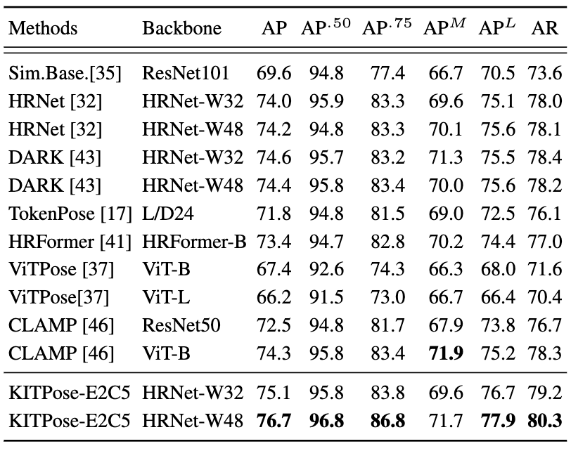
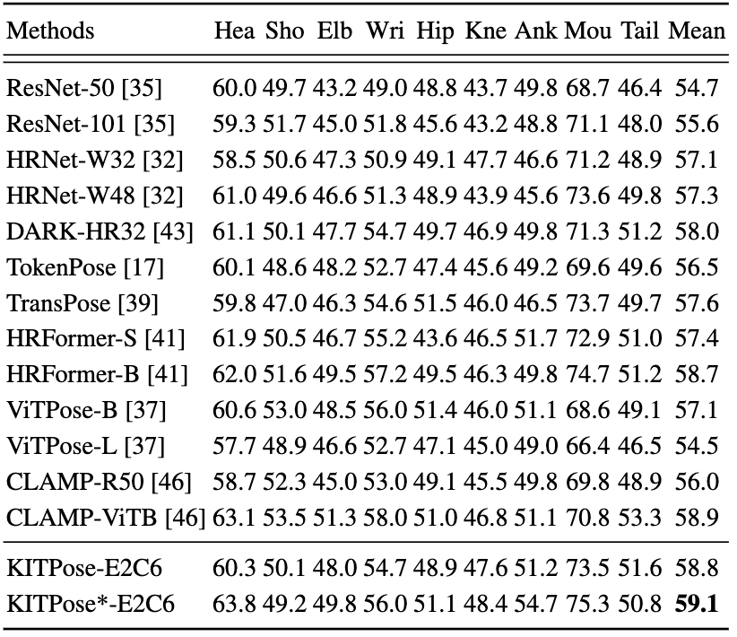
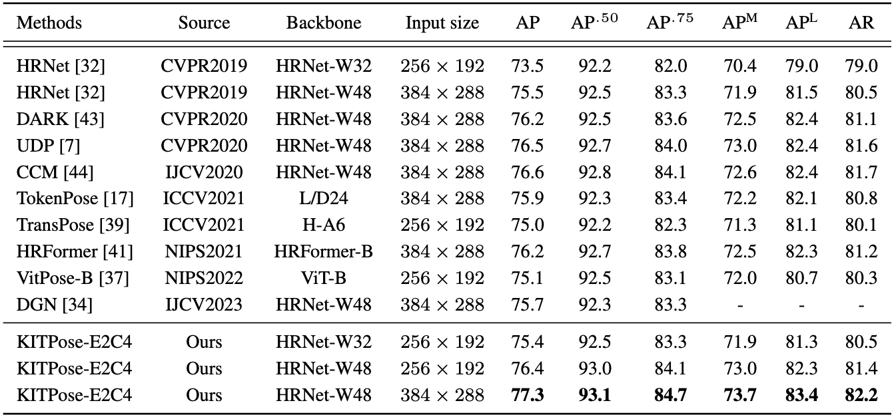
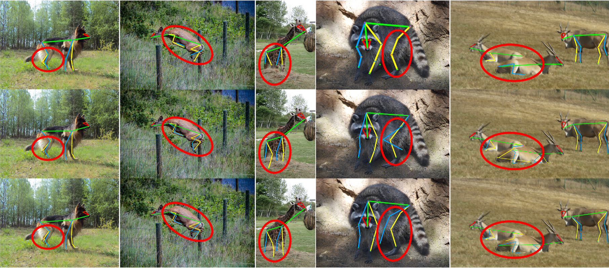
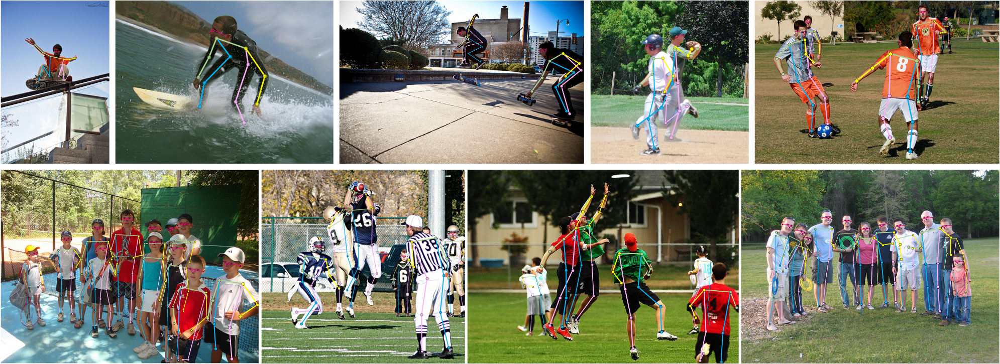

# Learning Structure-Supporting Dependencies via Keypoint Interactive Transformer for General Mammal Pose Estimation

[Tianyang Xu](https://xu-tianyang.github.io/), [Jiyong Rao](https://scholar.google.com/citations?user=bGxBmaQAAAAJ&hl=en&oi=ao), [Xiaoning Song](https://scholar.google.co.uk/citations?user=qIGhZCcAAAAJ&hl=en), [Zhenhua Feng](https://scholar.google.co.uk/citations?user=Y6KtijIAAAAJ&hl=en), and [Xiao-Jun Wu](https://scholar.google.co.uk/citations?user=5IST34sAAAAJ&hl=en), "Learning Structure-Supporting Dependencies via Keypoint Interactive Transformer for General Mammal Pose Estimation", IJCV, 2025

[[paper](https://link.springer.com/article/10.1007/s11263-025-02355-0)] [[arXiv](http://arxiv.org/abs/2502.18214)] [[pretrained models](https://1drv.ms/f/c/516ca5af9c3a92b7/EqSxjqfURJRLnohjuJNnpuIBi8LAVUyJQ-cw7d39AbE4Mw?e=aMVTDo)]

#### 🔥🔥🔥 News

- **2025-02-24:** Code and pre-trained models are released. 🎊🎊🎊
- **2025-02-23:** This repo is released. 🚀📚
- **2025-01-06:** A long version is accepted by IJCV 2025 (We extended KITPose in both method and experiment settings).
- **2022-10-27:** KITPose is accepted to PRCV 2022, won the **Best Student Paper** award. 🎉🏆

---

> **Abstract:**
> This is an official pytorch implementation of [*Learning Structure-Supporting Dependencies via Keypoint Interactive Transformer for General Mammal Pose Estimation*](https://link.springer.com/article/10.1007/s11263-025-02355-0).
> In this work, to achieve general mammal pose estimation, we developed a novel keypoints-interactive model, namely KITPose, to pursue structure-supporting dependencies among keypoints and body parts. In particular, we explicitly disentangle the keypoint-specific clues from the backbone features without any spatial splitting. An effective design named Generalised Heatmap Regression Loss is proposed to enable the adaptive adjustment of intermediate features to optimise keypoint representations.
> Simultaneously, to preserve the semantic information in the image, a new concept, referred to as body part prompts, is introduced to provide discriminative context, organising the information interactions. Furthermore, to automatically balance the importance between each keypoints, a novel adaptive weight strategy is introduced to common MSE loss. The designed architecture reflects its superiority and generalisation for general mammal pose estimation, which has been evaluated through extensive experiments on the AP10K, AnimalKingdom, and COCO datasets.


## <a name="results"></a>🔎 Main Results

We achieve state-of-the-art performance. Detailed results can be found in the paper.
<details>
<summary>Quantitative Comparison on AP10k val (click to expand)</summary>
- results in Table 2 of the main paper.

<p align="center">
  
</p>
</details>

<details>
<summary>Quantitative Comparison on AnimalPose val & AnimalKingdom test (click to expand)</summary>
- results in Table 3 (Left) & Table 4 (Right) of the main paper.

<p align="center" style="display: flex; justify-content: center; gap: 50px;">
  
  
</p>
</details>

<details>
<summary>Quantitative Comparison on COCO test2017 (click to expand)</summary>
- results in Table 10 of the main paper.

<p align="center">
  
</p>
</details>

<details>
<summary>Visual Comparison on AP-10K (click to expand)</summary>
- results in Figure 8 of the main paper.

<p align="center">
  
</p>
</details>

<details>
<summary>Qualitative Results on COCO test2017 (click to expand)</summary>
- results in Figure 9 of the main paper.

<p align="center">
  
</p>
</details>

## ⚙️ Dependencies
- Python 3.6
- PyTorch 1.9.0
- NVIDIA GPU + [CUDA](https://developer.nvidia.com/cuda-downloads)

```bash
git clone https://github.com/Raojiyong/KITPose
conda create -n KITPose python=3.6
conda activate KITPose
# Install dependencies:
pip install -r requirements.txt -f https://download.pytorch.org/whl/torch_stable.html
# Make libs:
cd ${POSE_ROOT}/lib
make
# Install COCOAPI
cd ${POSE_ROOT}/cocoapi/PythonAPI
# Install into global site-packages:
make install
# Alternatively, if you do not have write access to global site-packages:
python3 setup.py install --user
```
It should be noted that we have made modifications to the [COCOAPI](https://github.com/cocodataset/cocoapi) here, primarily to adjust the _**sigmas**_ values for different datasets.

## 📦 Quick start

1. Init output(training model output directory) and log(tensorboard log directory) directory:

   ```
   mkdir output 
   mkdir log
   ```

   Your directory tree should look like this:

   ```
   ${POSE_ROOT}
   ├── data
   ├── experiments
   ├── lib
   ├── log
   ├── models
   ├── output
   ├── tools 
   ├── README.md
   └── requirements.txt
   ```

2. Download pretrained models from our model zoo ([OneDrive](https://1drv.ms/f/c/516ca5af9c3a92b7/EqSxjqfURJRLnohjuJNnpuIBi8LAVUyJQ-cw7d39AbE4Mw?e=aqgYHV))
   ```
   ${POSE_ROOT}
    `-- models
         |-- ap10k
         |   |-- KITPose_E2C4_w32_256x256.pth
         |   |-- KITPose_E2C4_w48_256x256.pth
         |   |-- KITPose_E2C4_w32_384x384.pth
         |   |-- KITPose_E2C4_w48_384x384.pth
         |-- ak
         |   |-- KITPose_E2C6_w32_256x256.pth
         |   |-- KITPose_E2C6_w48_256x256.pth
         `-- animalpose
         |   |-- KITPose_E2C5_w32_256x256.pth
         |   |-- KITPose_E2C5_w_256x256.pth
         `-- coco
         |   |-- KITPose_E2C4_w32_256x256.pth
         |   |-- KITPose_E2C4_w48_256x256.pth
         |   |-- KITPose_E2C4_w32_384x384.pth
         |   |-- KITPose_E2C4_w48_384x384.pth

   ```
## 🖨️ Data preparation 

**For AP-10K data**, please download the data from [AP10K](https://github.com/AlexTheBad/AP-10K) and put it in the data directory.
```
${POSE_ROOT}
|── data
    │── ap10k
        │-- annotations
        │   │-- ap10k-train-split1.json
        │   |-- ap10k-train-split2.json
        │   |-- ap10k-train-split3.json
        │   │-- ap10k-val-split1.json
        │   |-- ap10k-val-split2.json
        │   |-- ap10k-val-split3.json
        │   |-- ap10k-test-split1.json
        │   |-- ap10k-test-split2.json
        │   |-- ap10k-test-split3.json
        │-- data
        │   │-- 000000000001.jpg
        │   │-- 000000000002.jpg
        │   │-- ...

```
**For AnimalPose data**, we organize the data according to the MMPose:

1. Download the images of [PASCAL VOC2012](http://host.robots.ox.ac.uk/pascal/VOC/voc2012/#data), especially the five categories (dog, cat, sheep, cow, horse), which we use as trainval dataset.

2. Download the [test-set](https://drive.google.com/drive/folders/1DwhQobZlGntOXxdm7vQsE4bqbFmN3b9y?usp=sharing) images with raw annotations (1000 images, 5 categories).

3. We have pre-processed the annotations to make it compatible with MMPose. Please download the annotation files from [annotations](https://download.openmmlab.com/mmpose/datasets/animalpose_annotations.tar). If you would like to generate the annotations by yourself, please check our dataset parsing [codes](https://github.com/open-mmlab/mmpose/tree/dev-1.x/tools/dataset_converters/parse_animalpose_dataset.py).

Extract them under {POSE_ROOT}/data, and make them look like this:
```
${POSE_ROOT}
`── data
    │── animalpose
        │
        │-- VOC2012
        │   │-- Annotations
        │   │-- ImageSets
        │   │-- JPEGImages
        │   │-- SegmentationClass
        │   │-- SegmentationObject
        │
        │-- animalpose_image_part2
        │   │-- cat
        │   │-- cow
        │   │-- dog
        │   │-- horse
        │   │-- sheep
        │
        │-- annotations
        │   │-- animalpose_train.json
        │   |-- animalpose_val.json
        │   |-- animalpose_trainval.json
        │   │-- animalpose_test.json
        │
        │-- PASCAL2011_animal_annotation
        │   │-- cat
        │   │   |-- 2007_000528_1.xml
        │   │   |-- 2007_000549_1.xml
        │   │   │-- ...
        │   │-- cow
        │   │-- dog
        │   │-- horse
        │   │-- sheep
        │
        │-- annimalpose_anno2
        │   │-- cat
        │   │   |-- ca1.xml
        │   │   |-- ca2.xml
        │   │   │-- ...
        │   │-- cow
        │   │-- dog
        │   │-- horse
        │   │-- sheep

```
**For AnimalKingdom data**, please download the data from [AnimalKingdom](https://github.com/sutdcv/Animal-Kingdom?tab=readme-ov-file) and put it in the data directory.
```
${POSE_ROOT}
|-- data
`-- |-- ak_P3_mammal
    `-- |-- annot
        |   |-- test.json
        |   |-- train.json
        `-- images
            |-- AAACXZTV
            |-- AAAUILHH
```
**For COCO data**, please download from [COCO download](http://cocodataset.org/#download), 2017 Train/Val is needed for COCO keypoints training and validation. We also provide person detection result of COCO val2017 and test-dev2017 to reproduce our multi-person pose estimation results. Please download from [OneDrive](https://1drv.ms/f/s!AhIXJn_J-blWzzDXoz5BeFl8sWM-) or [GoogleDrive](https://drive.google.com/drive/folders/1fRUDNUDxe9fjqcRZ2bnF_TKMlO0nB_dk?usp=sharing).
Download and extract them under {POSE_ROOT}/data, and make them look like this:
```
${POSE_ROOT}
|-- data
`-- |-- coco
    `-- |-- annotations
        |   |-- person_keypoints_train2017.json
        |   `-- person_keypoints_val2017.json
        |-- person_detection_results
        |   |-- COCO_val2017_detections_AP_H_56_person.json
        |   |-- COCO_test-dev2017_detections_AP_H_609_person.json
        `-- images
            |-- train2017
            |   |-- 000000000009.jpg
            |   |-- 000000000025.jpg
            |   |-- 000000000030.jpg
            |   |-- ... 
            `-- val2017
                |-- 000000000139.jpg
                |-- 000000000285.jpg
                |-- 000000000632.jpg
                |-- ... 
```


## 🔨 Training and Testing
### Training
- Run the following scripts. The training configuration is in `experiments/`.
```shell
# ap-10k training script
CUDA_VISIBLE_DEVICES=0,1,2,3 python tools/adaW_train_cutmix_part.py --cfg experiments/ap10k/kitpose_part/2Encoder_w32_256x256_adaW_cutmix_p4.yaml
# coco training script
CUDA_VISIBLE_DEVICES=0,1,2,3 python tools/adaW_train_cutmix_part.py --cfg experiments/coco/kitpose_part/2Encoder_w32_256x256_adaW_cutmix_p4.yaml
```

### Testing
- Run the following scripts. The testing configuration is also in `experiments/`.
```shell
# ap-10k testing script
CUDA_VISIBLE_DEVICES=0 python tools/adaW_test_cutmix_part.py \
  --cfg experiments/ap10k/kitpose_part/2Encoder_w32_256x256_adaW_cutmix_p4.yaml
# coco val2017 testing script
CUDA_VISIBLE_DEVICES=0 python tools/adaW_test_cutmix_part.py \
  --cfg experiments/coco/kitpose_part/2Encoder_w32_256x256_adaW_cutmix_p4.yaml \
  TEST.USE_GT_BBOX False
```

## 🔗 Citation
If you find our work helpful for your research, please consider citing the following BibTex entry:
```
@article{xu2025learning,
  title={Learning Structure-Supporting Dependencies via Keypoint Interactive Transformer for General Mammal Pose Estimation},
  author={Xu, Tianyang and Rao, Jiyong and Song, Xiaoning and Feng, Zhenhua and Wu, Xiao-Jun},
  journal={International Journal of Computer Vision},
  pages={1--19},
  year={2025},
  publisher={Springer}
}

@inproceedings{rao2022kitpose,
  title={Kitpose: Keypoint-interactive transformer for animal pose estimation},
  author={Rao, Jiyong and Xu, Tianyang and Song, Xiaoning and Feng, Zhen-Hua and Wu, Xiao-Jun},
  booktitle={Chinese Conference on Pattern Recognition and Computer Vision (PRCV)},
  pages={660--673},
  year={2022},
  organization={Springer}
}
```

## <a name="acknowledgements"></a>💡 Acknowledgements
This code is built on [HRNet](https://github.com/leoxiaobin/deep-high-resolution-net.pytorch).
